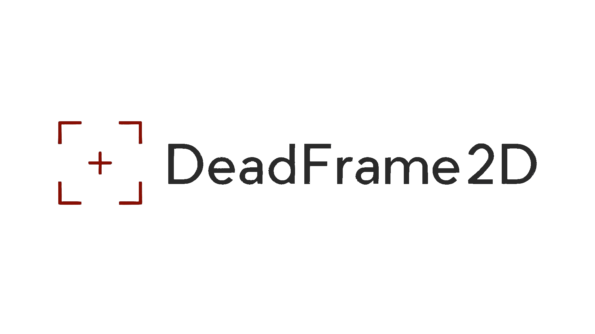

# DeadFrame2D

**DeadFrame2D** is a lightweight 2D game engine built with C++ and SDL2, optimized for fast prototyping and high-performance development.

## Features
- 🎨 2D rendering using SDL2  
- ⚙️ Physics-based collision handling using Box2D 
- 🧱 Entity Component System (ECS) architecture
- 🎮 Input handling (Mouse&Keyboard + Controller)
- 🎮 Scene-based architecture (similar to Unity) 
- 🎨 Tile renderer with interfaces for "Tiled" map support 
- ⏳ Coroutine support  
- 🧠 Event-driven memory management  
- 🐞 Debug mode (debug draws for colliders and more) 
- 🔧 Premake-based build system

## Getting Started

### Requirements

- C++17 or later  
- Compatible compiler (MSVC, Clang, GCC)  
- Premake (included in `Vendor/Premake`)  
- SDL2 and related libraries (included in `Vendor/SDL`)  
- Box2D physics library (included as a submodule) 
- Build tools: `make`, `ninja`, or MSBuild depending on platform  
- Supported OS: Windows 10 or later, major Linux distros  

### Setup
Run the batch script to generate project files and set up the environment:

| Platform |            Script           |
| -------- | --------------------------- |
| Windows  | `Scripts/Setup-Windows.bat` |
| Linux    | `Scripts/Setup-Linux.sh`    |

This will also update the submodules and add a git hook to ritrigger the setup when a branch is checked out.
